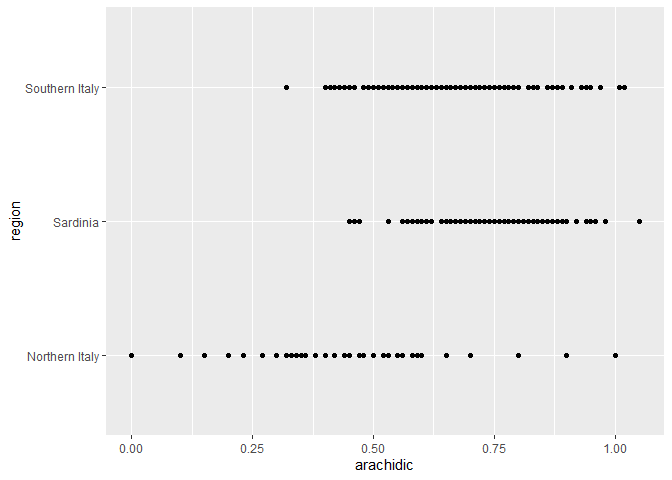
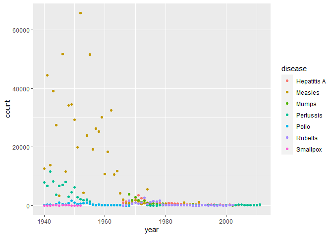
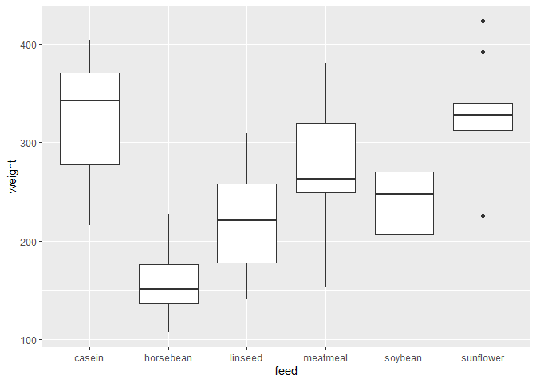

introdatascience
================
ljimenez
2022-06-21

-   [Weekly practical 2: writing scientific
    report](#weekly-practical-2-writing-scientific-report)
    -   [Master thesis in Budongo](#master-thesis-in-budongo)
    -   [Introduction](#introduction)
        -   [1: State of the art](#1-state-of-the-art)
        -   [2: Research question](#2-research-question)
        -   [3: Hypotheses](#3-hypotheses)
    -   [Methods](#methods)
        -   [*Step 1*](#step-1)
        -   [*Step 2*](#step-2)
        -   [References](#references)
-   [weekly practical 3: data](#weekly-practical-3-data)
    -   [Exercice 1: r preloaded
        dataset](#exercice-1-r-preloaded-dataset)
        -   [weight](#weight)
        -   [feed](#feed)
    -   [Exercice 2: dataset from an external
        source](#exercice-2-dataset-from-an-external-source)
        -   [first dataset](#first-dataset)
        -   [References](#references-1)
-   [Weekly practical 4: data
    wrangling](#weekly-practical-4-data-wrangling)
    -   [Filter the dataset](#filter-the-dataset)
    -   [Arrange the dataset](#arrange-the-dataset)
    -   [Summarize the results](#summarize-the-results)
    -   [Remove the NA observations](#remove-the-na-observations)
    -   [Join two dataset](#join-two-dataset)
    -   [References](#references-2)
-   [Weekly practicals 5: data visualization
    I](#weekly-practicals-5-data-visualization-i)
    -   [Description of the data](#description-of-the-data)
    -   [transform into long format](#transform-into-long-format)
    -   [tidy format](#tidy-format)
    -   [unite columns](#unite-columns)
    -   [Separate](#separate)
    -   [plot](#plot)
    -   [References](#references-3)
-   [Weekly practical 6: data visualization
    II](#weekly-practical-6-data-visualization-ii)
    -   [first question](#first-question)
    -   [Second question](#second-question)
    -   [References](#references-4)
-   [weekly practical 7: data
    modeling](#weekly-practical-7-data-modeling)
    -   [Visualize the data](#visualize-the-data)
    -   [statistics](#statistics)
    -   [References](#references-5)

# Weekly practical 2: writing scientific report

Lorène Jimenez, spring 2022

## Master thesis in Budongo

## Introduction

1.  State of the art
2.  Research question
3.  Hypotheses

### 1: State of the art

Many mammals produce food calls to inform conspecifics that they found a
new source of food. Chimpanzees represent a species that use this
mechanism often. The exact function of this behavior is not yet known.
Different hypotheses have been raised: for example, it has been
suggested that food calls allow individuals to strengthen their social
bonds. However, this hypothesis is not enough to explain the existence
of this behavior which imply a considerable cost for the caller. An
important question to ask is: how is this behavior induced in
individuals if it does not imply a direct benefit for them? One
possibility is that this behavior is induced by group control from other
individuals because it benefits the group as a whole. More precisely, I
will try to show that chimpanzees use negative direct reciprocity as a
mechanism to “punish” individuals that did not produce a food call when
they could have.

### 2: Research question

Is direct negative reciprocity used to induce cooperative behavior in
food-sharing contexts in chimpanzees?

### 3: Hypotheses

1.  If an individual does not produce a food call when he had the
    occasion, and if others discover it, they produce an aggressive
    answer (negative direct reciprocity).
2.  The individual that undergoes this aggressive answer will increase
    his food calling in the near future.

## Methods

### *Step 1*

Data collection will occur in **Budongo Conservation Field Station**. It
will last 6 months, from August 2022 to February 2023.

### *Step 2*

I will write my thesis during the second semester of my second year,
spring 2023.


Here is a table for a preloaded dataset in r, the dataset `HairEyeColor`
(Snee, 1974)

``` r
library(knitr)
kable(HairEyeColor)
```

| Hair  | Eye   | Sex    | Freq |
|:------|:------|:-------|-----:|
| Black | Brown | Male   |   32 |
| Brown | Brown | Male   |   53 |
| Red   | Brown | Male   |   10 |
| Blond | Brown | Male   |    3 |
| Black | Blue  | Male   |   11 |
| Brown | Blue  | Male   |   50 |
| Red   | Blue  | Male   |   10 |
| Blond | Blue  | Male   |   30 |
| Black | Hazel | Male   |   10 |
| Brown | Hazel | Male   |   25 |
| Red   | Hazel | Male   |    7 |
| Blond | Hazel | Male   |    5 |
| Black | Green | Male   |    3 |
| Brown | Green | Male   |   15 |
| Red   | Green | Male   |    7 |
| Blond | Green | Male   |    8 |
| Black | Brown | Female |   36 |
| Brown | Brown | Female |   66 |
| Red   | Brown | Female |   16 |
| Blond | Brown | Female |    4 |
| Black | Blue  | Female |    9 |
| Brown | Blue  | Female |   34 |
| Red   | Blue  | Female |    7 |
| Blond | Blue  | Female |   64 |
| Black | Hazel | Female |    5 |
| Brown | Hazel | Female |   29 |
| Red   | Hazel | Female |    7 |
| Blond | Hazel | Female |    5 |
| Black | Green | Female |    2 |
| Brown | Green | Female |   14 |
| Red   | Green | Female |    7 |
| Blond | Green | Female |    8 |

### References

Snee, R. D. (1974). Graphical display of two-way contingency tables. The
American Statistician, 28, 9–12. <doi:10.2307/2683520>.

# weekly practical 3: data

## Exercice 1: r preloaded dataset

For this exercice, I have chosen to work with the preloaded data
`chickwts` from R (McNeil, 1977). This dataset describes the weight of
chicken according to type of food they ate:

``` r
library(knitr)
kable(chickwts)
```

| weight | feed      |
|-------:|:----------|
|    179 | horsebean |
|    160 | horsebean |
|    136 | horsebean |
|    227 | horsebean |
|    217 | horsebean |
|    168 | horsebean |
|    108 | horsebean |
|    124 | horsebean |
|    143 | horsebean |
|    140 | horsebean |
|    309 | linseed   |
|    229 | linseed   |
|    181 | linseed   |
|    141 | linseed   |
|    260 | linseed   |
|    203 | linseed   |
|    148 | linseed   |
|    169 | linseed   |
|    213 | linseed   |
|    257 | linseed   |
|    244 | linseed   |
|    271 | linseed   |
|    243 | soybean   |
|    230 | soybean   |
|    248 | soybean   |
|    327 | soybean   |
|    329 | soybean   |
|    250 | soybean   |
|    193 | soybean   |
|    271 | soybean   |
|    316 | soybean   |
|    267 | soybean   |
|    199 | soybean   |
|    171 | soybean   |
|    158 | soybean   |
|    248 | soybean   |
|    423 | sunflower |
|    340 | sunflower |
|    392 | sunflower |
|    339 | sunflower |
|    341 | sunflower |
|    226 | sunflower |
|    320 | sunflower |
|    295 | sunflower |
|    334 | sunflower |
|    322 | sunflower |
|    297 | sunflower |
|    318 | sunflower |
|    325 | meatmeal  |
|    257 | meatmeal  |
|    303 | meatmeal  |
|    315 | meatmeal  |
|    380 | meatmeal  |
|    153 | meatmeal  |
|    263 | meatmeal  |
|    242 | meatmeal  |
|    206 | meatmeal  |
|    344 | meatmeal  |
|    258 | meatmeal  |
|    368 | casein    |
|    390 | casein    |
|    379 | casein    |
|    260 | casein    |
|    404 | casein    |
|    318 | casein    |
|    352 | casein    |
|    359 | casein    |
|    216 | casein    |
|    222 | casein    |
|    283 | casein    |
|    332 | casein    |

Here is the structure of this dataset:

``` r
data(chickwts)
head(chickwts, 6)
```

    ##   weight      feed
    ## 1    179 horsebean
    ## 2    160 horsebean
    ## 3    136 horsebean
    ## 4    227 horsebean
    ## 5    217 horsebean
    ## 6    168 horsebean

``` r
str(chickwts)
```

    ## 'data.frame':    71 obs. of  2 variables:
    ##  $ weight: num  179 160 136 227 217 168 108 124 143 140 ...
    ##  $ feed  : Factor w/ 6 levels "casein","horsebean",..: 2 2 2 2 2 2 2 2 2 2 ...

What kind of R data type is it?

### weight

weight is a numerical variable describing the weight of chickens.

### feed

Feed is a factor variable describing the type of food ingested by
chickens. There are 6 possibilities.

## Exercice 2: dataset from an external source

### first dataset

For this exercise I have decided to use a dataset from a [pudding
article](https://pudding.cool/2019/04/vogue/) about the skin tones of
models in the cover of Vogue magazine.

``` r
face <- read.csv("https://raw.githubusercontent.com/the-pudding/data/master/vogue/faces.csv")
head(face, 6)
```

    ##        date           model    tone         l
    ## 1  1/1/2018   Lupita Nyongo #402C2C 0.2127451
    ## 2 10/1/2015   Lupita Nyongo #58342B 0.2574230
    ## 3  3/1/2009  Michelle Obama #844930 0.3541176
    ## 4  4/1/2015 Serena Williams #875038 0.3750000
    ## 5  7/1/2014   Lupita Nyongo #85524F 0.4166667
    ## 6 10/1/2016   Lupita Nyongo #8F5347 0.4205882

``` r
str(face)
```

    ## 'data.frame':    262 obs. of  4 variables:
    ##  $ date : chr  "1/1/2018" "10/1/2015" "3/1/2009" "4/1/2015" ...
    ##  $ model: chr  "Lupita Nyongo" "Lupita Nyongo" "Michelle Obama" "Serena Williams" ...
    ##  $ tone : chr  "#402C2C" "#58342B" "#844930" "#875038" ...
    ##  $ l    : num  0.213 0.257 0.354 0.375 0.417 ...

This dataset contains 4 variables. The first one, `date`, gives the date
of the publication of the magazine. The second one, `model`, gives the
name of the model on the cover. `tone` is the hex code for the skin
color of each model. Finally, `l` represents the lightness of the skin
tone for each model, converted to hsl format. The first variable is a
date-type variable, `model` and `tone` are text variables and the last
one is float variable.

\###second data set This dataset also comes from a [pudding
article](https://pudding.cool/2017/07/cetaceans/).

``` r
acquisitions <- read.csv("https://raw.githubusercontent.com/the-pudding/data/master/cetaceans/acquisitions.csv")
head(acquisitions, 6)
```

    ##   X AcqYear Born Capture Rescue Total
    ## 1 1    1938    0       5      0     5
    ## 2 2    1939    0       7      0     7
    ## 3 3    1940    0       0      0     0
    ## 4 4    1941    0       0      0     0
    ## 5 5    1942    0       0      0     0
    ## 6 6    1943    0       0      0     0

``` r
str(acquisitions)
```

    ## 'data.frame':    80 obs. of  6 variables:
    ##  $ X      : int  1 2 3 4 5 6 7 8 9 10 ...
    ##  $ AcqYear: int  1938 1939 1940 1941 1942 1943 1944 1945 1946 1947 ...
    ##  $ Born   : int  0 0 0 0 0 0 0 0 0 1 ...
    ##  $ Capture: int  5 7 0 0 0 0 0 0 3 0 ...
    ##  $ Rescue : int  0 0 0 0 0 0 0 0 0 0 ...
    ##  $ Total  : int  5 7 0 0 0 0 0 0 3 1 ...

This dataset contains 4 variables, all number variables in r. `AcqYear`
gives the year the animal joined the community. `Born` gives the number
of cetaceans that were born in captivity during a given year. `Capture`
gives the number of cetaceans that were captures during a certain year.
Finally, `rescue` gives the number of cetaceans that were rescued during
a given year.

All variables are quantitative discrete variables.

### References

McNeil, D. R. (1977) Interactive Data Analysis. New York: Wiley.
<https://pudding.cool/2019/04/vogue/>
<https://pudding.cool/2017/07/cetaceans/>

# Weekly practical 4: data wrangling

I will be using the `gapminder` dataset from the `dslabs` package, which
represents information such as life expectancy or infant death rates for
different countries over the years.

``` r
library(rlang)
library(dslabs)
library(dplyr)
library(knitr)
```

### Filter the dataset

I can now filter this dataset to look more precisely at the observations
in Finland and in Greece between 1975 and now, because those are great
places to be:

``` r
data(gapminder)
gapminder2 <- gapminder %>%
  filter(country %in% c("Finland", "Greece"), year>=1975)
head(gapminder2) %>% kable()
```

| country | year | infant_mortality | life_expectancy | fertility | population |         gdp | continent | region          |
|:--------|-----:|-----------------:|----------------:|----------:|-----------:|------------:|:----------|:----------------|
| Finland | 1975 |             10.0 |           71.89 |      1.69 |    4711459 | 62868988391 | Europe    | Northern Europe |
| Greece  | 1975 |             28.5 |           72.62 |      2.34 |    9030080 | 75149963026 | Europe    | Southern Europe |
| Finland | 1976 |              9.4 |           72.04 |      1.72 |    4726803 | 63085498434 | Europe    | Northern Europe |
| Greece  | 1976 |             27.3 |           72.85 |      2.34 |    9132531 | 80299161830 | Europe    | Southern Europe |
| Finland | 1977 |              8.7 |           72.56 |      1.69 |    4738949 | 63236594804 | Europe    | Northern Europe |
| Greece  | 1977 |             25.9 |           73.10 |      2.32 |    9255749 | 82660761559 | Europe    | Southern Europe |

Let’s now look only at the life expectancy of those countries, by year,
and display the first and last rows of the data frame as well as its
structure:

``` r
gapminder2 <- gapminder2 %>% select(life_expectancy, country, year)
head(gapminder2) %>% kable()
```

| life_expectancy | country | year |
|----------------:|:--------|-----:|
|           71.89 | Finland | 1975 |
|           72.62 | Greece  | 1975 |
|           72.04 | Finland | 1976 |
|           72.85 | Greece  | 1976 |
|           72.56 | Finland | 1977 |
|           73.10 | Greece  | 1977 |

``` r
tail(gapminder2) %>% kable()
```

|     | life_expectancy | country | year |
|:----|----------------:|:--------|-----:|
| 79  |            80.9 | Finland | 2014 |
| 80  |            81.0 | Greece  | 2014 |
| 81  |            80.9 | Finland | 2015 |
| 82  |            81.0 | Greece  | 2015 |
| 83  |            80.9 | Finland | 2016 |
| 84  |            81.0 | Greece  | 2016 |

``` r
str(gapminder2)
```

    ## 'data.frame':    84 obs. of  3 variables:
    ##  $ life_expectancy: num  71.9 72.6 72 72.8 72.6 ...
    ##  $ country        : Factor w/ 185 levels "Albania","Algeria",..: 57 65 57 65 57 65 57 65 57 65 ...
    ##  $ year           : int  1975 1975 1976 1976 1977 1977 1978 1978 1979 1979 ...

### Arrange the dataset

Here is the data arranged by country and year, highest to lowest
fertility:

``` r
gapminder2 %>% arrange(desc(year), life_expectancy, country)
```

    ##    life_expectancy country year
    ## 1            80.90 Finland 2016
    ## 2            81.00  Greece 2016
    ## 3            80.90 Finland 2015
    ## 4            81.00  Greece 2015
    ## 5            80.90 Finland 2014
    ## 6            81.00  Greece 2014
    ## 7            80.80 Finland 2013
    ## 8            81.00  Greece 2013
    ## 9            80.50 Finland 2012
    ## 10           80.60  Greece 2012
    ## 11           80.30 Finland 2011
    ## 12           80.50  Greece 2011
    ## 13           80.00 Finland 2010
    ## 14           80.40  Greece 2010
    ## 15           79.80 Finland 2009
    ## 16           80.20  Greece 2009
    ## 17           79.60 Finland 2008
    ## 18           80.20  Greece 2008
    ## 19           79.40 Finland 2007
    ## 20           79.80  Greece 2007
    ## 21           79.20 Finland 2006
    ## 22           80.00  Greece 2006
    ## 23           79.00 Finland 2005
    ## 24           79.60  Greece 2005
    ## 25           78.80 Finland 2004
    ## 26           79.40  Greece 2004
    ## 27           78.50 Finland 2003
    ## 28           79.30  Greece 2003
    ## 29           78.30 Finland 2002
    ## 30           79.10  Greece 2002
    ## 31           78.10 Finland 2001
    ## 32           78.90  Greece 2001
    ## 33           77.80 Finland 2000
    ## 34           78.60  Greece 2000
    ## 35           77.50 Finland 1999
    ## 36           78.30  Greece 1999
    ## 37           77.30 Finland 1998
    ## 38           78.20  Greece 1998
    ## 39           77.10 Finland 1997
    ## 40           78.10  Greece 1997
    ## 41           76.80 Finland 1996
    ## 42           77.90  Greece 1996
    ## 43           76.70 Finland 1995
    ## 44           77.80  Greece 1995
    ## 45           76.40 Finland 1994
    ## 46           77.70  Greece 1994
    ## 47           76.00 Finland 1993
    ## 48           77.50  Greece 1993
    ## 49           75.70 Finland 1992
    ## 50           77.10  Greece 1992
    ## 51           75.40 Finland 1991
    ## 52           77.10  Greece 1991
    ## 53           75.10 Finland 1990
    ## 54           77.00  Greece 1990
    ## 55           75.07 Finland 1989
    ## 56           76.66  Greece 1989
    ## 57           74.85 Finland 1988
    ## 58           76.32  Greece 1988
    ## 59           74.89 Finland 1987
    ## 60           76.01  Greece 1987
    ## 61           74.86 Finland 1986
    ## 62           75.73  Greece 1986
    ## 63           74.49 Finland 1985
    ## 64           75.47  Greece 1985
    ## 65           74.82 Finland 1984
    ## 66           75.21  Greece 1984
    ## 67           74.51 Finland 1983
    ## 68           74.94  Greece 1983
    ## 69           74.60 Finland 1982
    ## 70           74.64  Greece 1982
    ## 71           74.03 Finland 1981
    ## 72           74.33  Greece 1981
    ## 73           73.71 Finland 1980
    ## 74           74.01  Greece 1980
    ## 75           73.42 Finland 1979
    ## 76           73.68  Greece 1979
    ## 77           73.13 Finland 1978
    ## 78           73.38  Greece 1978
    ## 79           72.56 Finland 1977
    ## 80           73.10  Greece 1977
    ## 81           72.04 Finland 1976
    ## 82           72.85  Greece 1976
    ## 83           71.89 Finland 1975
    ## 84           72.62  Greece 1975

``` r
print(gapminder2) %>% kable()
```

    ##    life_expectancy country year
    ## 1            71.89 Finland 1975
    ## 2            72.62  Greece 1975
    ## 3            72.04 Finland 1976
    ## 4            72.85  Greece 1976
    ## 5            72.56 Finland 1977
    ## 6            73.10  Greece 1977
    ## 7            73.13 Finland 1978
    ## 8            73.38  Greece 1978
    ## 9            73.42 Finland 1979
    ## 10           73.68  Greece 1979
    ## 11           73.71 Finland 1980
    ## 12           74.01  Greece 1980
    ## 13           74.03 Finland 1981
    ## 14           74.33  Greece 1981
    ## 15           74.60 Finland 1982
    ## 16           74.64  Greece 1982
    ## 17           74.51 Finland 1983
    ## 18           74.94  Greece 1983
    ## 19           74.82 Finland 1984
    ## 20           75.21  Greece 1984
    ## 21           74.49 Finland 1985
    ## 22           75.47  Greece 1985
    ## 23           74.86 Finland 1986
    ## 24           75.73  Greece 1986
    ## 25           74.89 Finland 1987
    ## 26           76.01  Greece 1987
    ## 27           74.85 Finland 1988
    ## 28           76.32  Greece 1988
    ## 29           75.07 Finland 1989
    ## 30           76.66  Greece 1989
    ## 31           75.10 Finland 1990
    ## 32           77.00  Greece 1990
    ## 33           75.40 Finland 1991
    ## 34           77.10  Greece 1991
    ## 35           75.70 Finland 1992
    ## 36           77.10  Greece 1992
    ## 37           76.00 Finland 1993
    ## 38           77.50  Greece 1993
    ## 39           76.40 Finland 1994
    ## 40           77.70  Greece 1994
    ## 41           76.70 Finland 1995
    ## 42           77.80  Greece 1995
    ## 43           76.80 Finland 1996
    ## 44           77.90  Greece 1996
    ## 45           77.10 Finland 1997
    ## 46           78.10  Greece 1997
    ## 47           77.30 Finland 1998
    ## 48           78.20  Greece 1998
    ## 49           77.50 Finland 1999
    ## 50           78.30  Greece 1999
    ## 51           77.80 Finland 2000
    ## 52           78.60  Greece 2000
    ## 53           78.10 Finland 2001
    ## 54           78.90  Greece 2001
    ## 55           78.30 Finland 2002
    ## 56           79.10  Greece 2002
    ## 57           78.50 Finland 2003
    ## 58           79.30  Greece 2003
    ## 59           78.80 Finland 2004
    ## 60           79.40  Greece 2004
    ## 61           79.00 Finland 2005
    ## 62           79.60  Greece 2005
    ## 63           79.20 Finland 2006
    ## 64           80.00  Greece 2006
    ## 65           79.40 Finland 2007
    ## 66           79.80  Greece 2007
    ## 67           79.60 Finland 2008
    ## 68           80.20  Greece 2008
    ## 69           79.80 Finland 2009
    ## 70           80.20  Greece 2009
    ## 71           80.00 Finland 2010
    ## 72           80.40  Greece 2010
    ## 73           80.30 Finland 2011
    ## 74           80.50  Greece 2011
    ## 75           80.50 Finland 2012
    ## 76           80.60  Greece 2012
    ## 77           80.80 Finland 2013
    ## 78           81.00  Greece 2013
    ## 79           80.90 Finland 2014
    ## 80           81.00  Greece 2014
    ## 81           80.90 Finland 2015
    ## 82           81.00  Greece 2015
    ## 83           80.90 Finland 2016
    ## 84           81.00  Greece 2016

| life_expectancy | country | year |
|----------------:|:--------|-----:|
|           71.89 | Finland | 1975 |
|           72.62 | Greece  | 1975 |
|           72.04 | Finland | 1976 |
|           72.85 | Greece  | 1976 |
|           72.56 | Finland | 1977 |
|           73.10 | Greece  | 1977 |
|           73.13 | Finland | 1978 |
|           73.38 | Greece  | 1978 |
|           73.42 | Finland | 1979 |
|           73.68 | Greece  | 1979 |
|           73.71 | Finland | 1980 |
|           74.01 | Greece  | 1980 |
|           74.03 | Finland | 1981 |
|           74.33 | Greece  | 1981 |
|           74.60 | Finland | 1982 |
|           74.64 | Greece  | 1982 |
|           74.51 | Finland | 1983 |
|           74.94 | Greece  | 1983 |
|           74.82 | Finland | 1984 |
|           75.21 | Greece  | 1984 |
|           74.49 | Finland | 1985 |
|           75.47 | Greece  | 1985 |
|           74.86 | Finland | 1986 |
|           75.73 | Greece  | 1986 |
|           74.89 | Finland | 1987 |
|           76.01 | Greece  | 1987 |
|           74.85 | Finland | 1988 |
|           76.32 | Greece  | 1988 |
|           75.07 | Finland | 1989 |
|           76.66 | Greece  | 1989 |
|           75.10 | Finland | 1990 |
|           77.00 | Greece  | 1990 |
|           75.40 | Finland | 1991 |
|           77.10 | Greece  | 1991 |
|           75.70 | Finland | 1992 |
|           77.10 | Greece  | 1992 |
|           76.00 | Finland | 1993 |
|           77.50 | Greece  | 1993 |
|           76.40 | Finland | 1994 |
|           77.70 | Greece  | 1994 |
|           76.70 | Finland | 1995 |
|           77.80 | Greece  | 1995 |
|           76.80 | Finland | 1996 |
|           77.90 | Greece  | 1996 |
|           77.10 | Finland | 1997 |
|           78.10 | Greece  | 1997 |
|           77.30 | Finland | 1998 |
|           78.20 | Greece  | 1998 |
|           77.50 | Finland | 1999 |
|           78.30 | Greece  | 1999 |
|           77.80 | Finland | 2000 |
|           78.60 | Greece  | 2000 |
|           78.10 | Finland | 2001 |
|           78.90 | Greece  | 2001 |
|           78.30 | Finland | 2002 |
|           79.10 | Greece  | 2002 |
|           78.50 | Finland | 2003 |
|           79.30 | Greece  | 2003 |
|           78.80 | Finland | 2004 |
|           79.40 | Greece  | 2004 |
|           79.00 | Finland | 2005 |
|           79.60 | Greece  | 2005 |
|           79.20 | Finland | 2006 |
|           80.00 | Greece  | 2006 |
|           79.40 | Finland | 2007 |
|           79.80 | Greece  | 2007 |
|           79.60 | Finland | 2008 |
|           80.20 | Greece  | 2008 |
|           79.80 | Finland | 2009 |
|           80.20 | Greece  | 2009 |
|           80.00 | Finland | 2010 |
|           80.40 | Greece  | 2010 |
|           80.30 | Finland | 2011 |
|           80.50 | Greece  | 2011 |
|           80.50 | Finland | 2012 |
|           80.60 | Greece  | 2012 |
|           80.80 | Finland | 2013 |
|           81.00 | Greece  | 2013 |
|           80.90 | Finland | 2014 |
|           81.00 | Greece  | 2014 |
|           80.90 | Finland | 2015 |
|           81.00 | Greece  | 2015 |
|           80.90 | Finland | 2016 |
|           81.00 | Greece  | 2016 |

It’s interesting to note that each year, life expectancy is slightly
higher in Greece as compared to Finland. Also, for both countries, life
expectancy has increased of around 8 years in 41 years (1975 to 2016)
which seems to be a huge progress.

### Summarize the results

To summarize those results, we can calculate the mean of life expectancy
for both countries:

``` r
    gapminder3 <- gapminder2 %>% 
      group_by(country) %>% 
      summarize(average_life_expectancy=mean(life_expectancy, na.rm=T)) %>% 
      arrange(average_life_expectancy)
    print(gapminder3) %>% kable()
```

    ## # A tibble: 2 × 2
    ##   country average_life_expectancy
    ##   <fct>                     <dbl>
    ## 1 Finland                    76.8
    ## 2 Greece                     77.5

| country | average_life_expectancy |
|:--------|------------------------:|
| Finland |                76.80167 |
| Greece  |                77.52976 |

As we can see, life expectancy has been similar over the year 1975 to
2016 on average between Finland and Greece. We can still confirm that
Greece had a slightly higher life expectancy than Finland.

### Remove the NA observations

``` r
gapminder4 <- na.omit(gapminder2)
str(gapminder4)
```

    ## 'data.frame':    84 obs. of  3 variables:
    ##  $ life_expectancy: num  71.9 72.6 72 72.8 72.6 ...
    ##  $ country        : Factor w/ 185 levels "Albania","Algeria",..: 57 65 57 65 57 65 57 65 57 65 ...
    ##  $ year           : int  1975 1975 1976 1976 1977 1977 1978 1978 1979 1979 ...

Apparently, there was no NA observation in this dataset.

### Join two dataset

Here is the two datasets from `dslabs` package,
`results_us_election_2016` and `murders`:

``` r
full_join(results_us_election_2016, murders) %>% kable()
```

    ## Joining, by = "state"

| state                | electoral_votes | clinton | trump | others | abb | region        | population | total |
|:---------------------|----------------:|--------:|------:|-------:|:----|:--------------|-----------:|------:|
| California           |              55 |    61.7 |  31.6 |    6.7 | CA  | West          |   37253956 |  1257 |
| Texas                |              38 |    43.2 |  52.2 |    4.5 | TX  | South         |   25145561 |   805 |
| Florida              |              29 |    47.8 |  49.0 |    3.2 | FL  | South         |   19687653 |   669 |
| New York             |              29 |    59.0 |  36.5 |    4.5 | NY  | Northeast     |   19378102 |   517 |
| Illinois             |              20 |    55.8 |  38.8 |    5.4 | IL  | North Central |   12830632 |   364 |
| Pennsylvania         |              20 |    47.9 |  48.6 |    3.6 | PA  | Northeast     |   12702379 |   457 |
| Ohio                 |              18 |    43.5 |  51.7 |    4.8 | OH  | North Central |   11536504 |   310 |
| Georgia              |              16 |    45.9 |  51.0 |    3.1 | GA  | South         |    9920000 |   376 |
| Michigan             |              16 |    47.3 |  47.5 |    5.2 | MI  | North Central |    9883640 |   413 |
| North Carolina       |              15 |    46.2 |  49.8 |    4.0 | NC  | South         |    9535483 |   286 |
| New Jersey           |              14 |    55.5 |  41.4 |    3.2 | NJ  | Northeast     |    8791894 |   246 |
| Virginia             |              13 |    49.8 |  44.4 |    5.8 | VA  | South         |    8001024 |   250 |
| Washington           |              12 |    54.3 |  38.1 |    7.6 | WA  | West          |    6724540 |    93 |
| Arizona              |              11 |    45.1 |  48.7 |    6.2 | AZ  | West          |    6392017 |   232 |
| Indiana              |              11 |    37.8 |  56.9 |    5.3 | IN  | North Central |    6483802 |   142 |
| Massachusetts        |              11 |    60.0 |  32.8 |    7.2 | MA  | Northeast     |    6547629 |   118 |
| Tennessee            |              11 |    34.7 |  60.7 |    4.6 | TN  | South         |    6346105 |   219 |
| Maryland             |              10 |    60.3 |  33.9 |    5.8 | MD  | South         |    5773552 |   293 |
| Minnesota            |              10 |    46.4 |  44.9 |    8.6 | MN  | North Central |    5303925 |    53 |
| Missouri             |              10 |    38.1 |  56.8 |    5.1 | MO  | North Central |    5988927 |   321 |
| Wisconsin            |              10 |    46.5 |  47.2 |    6.3 | WI  | North Central |    5686986 |    97 |
| Alabama              |               9 |    34.4 |  62.1 |    3.6 | AL  | South         |    4779736 |   135 |
| Colorado             |               9 |    48.2 |  43.3 |    8.6 | CO  | West          |    5029196 |    65 |
| South Carolina       |               9 |    40.7 |  54.9 |    4.4 | SC  | South         |    4625364 |   207 |
| Kentucky             |               8 |    32.7 |  62.5 |    4.8 | KY  | South         |    4339367 |   116 |
| Louisiana            |               8 |    38.4 |  58.1 |    3.5 | LA  | South         |    4533372 |   351 |
| Connecticut          |               7 |    54.6 |  40.9 |    4.5 | CT  | Northeast     |    3574097 |    97 |
| Oklahoma             |               7 |    28.9 |  65.3 |    5.7 | OK  | South         |    3751351 |   111 |
| Oregon               |               7 |    50.1 |  39.1 |   10.8 | OR  | West          |    3831074 |    36 |
| Arkansas             |               6 |    33.7 |  60.6 |    5.8 | AR  | South         |    2915918 |    93 |
| Iowa                 |               6 |    41.7 |  51.1 |    7.1 | IA  | North Central |    3046355 |    21 |
| Kansas               |               6 |    36.1 |  56.7 |    7.3 | KS  | North Central |    2853118 |    63 |
| Mississippi          |               6 |    40.1 |  57.9 |    1.9 | MS  | South         |    2967297 |   120 |
| Nevada               |               6 |    47.9 |  45.5 |    6.6 | NV  | West          |    2700551 |    84 |
| Utah                 |               6 |    27.5 |  45.5 |   27.0 | UT  | West          |    2763885 |    22 |
| Nebraska             |               5 |    34.3 |  59.9 |    5.8 | NE  | North Central |    1826341 |    32 |
| New Mexico           |               5 |    48.3 |  40.0 |   11.7 | NM  | West          |    2059179 |    67 |
| West Virginia        |               5 |    26.5 |  68.6 |    4.9 | WV  | South         |    1852994 |    27 |
| Hawaii               |               4 |    62.2 |  30.0 |    7.7 | HI  | West          |    1360301 |     7 |
| Idaho                |               4 |    27.5 |  59.3 |   13.2 | ID  | West          |    1567582 |    12 |
| Maine                |               4 |    48.0 |  45.0 |    7.0 | ME  | Northeast     |    1328361 |    11 |
| New Hampshire        |               4 |    46.8 |  46.5 |    6.7 | NH  | Northeast     |    1316470 |     5 |
| Rhode Island         |               4 |    54.4 |  38.9 |    6.7 | RI  | Northeast     |    1052567 |    16 |
| Alaska               |               3 |    36.6 |  51.3 |   12.2 | AK  | West          |     710231 |    19 |
| Delaware             |               3 |    53.4 |  41.9 |    4.7 | DE  | South         |     897934 |    38 |
| Montana              |               3 |    35.9 |  56.5 |    7.6 | MT  | West          |     989415 |    12 |
| North Dakota         |               3 |    27.2 |  63.0 |    9.8 | ND  | North Central |     672591 |     4 |
| South Dakota         |               3 |    31.7 |  61.5 |    6.7 | SD  | North Central |     814180 |     8 |
| Vermont              |               3 |    56.7 |  30.3 |   13.1 | VT  | Northeast     |     625741 |     2 |
| Wyoming              |               3 |    21.9 |  68.2 |   10.0 | WY  | West          |     563626 |     5 |
| District of Columbia |               3 |    90.9 |   4.1 |    5.0 | DC  | South         |     601723 |    99 |

We could see if there is a relationship between murder rates and the way
people vote in each state.

### References

<https://rdocumentation.org/packages/dslabs/versions/0.7.4>

# Weekly practicals 5: data visualization I

### Description of the data

For this exercise, I will work with the dataset `olive` from the
`dslabs` package. This fascinating dataset describes the chemical
component of olives from different regions in Italy.

``` r
data(olive)
str(olive)
```

    ## 'data.frame':    572 obs. of  10 variables:
    ##  $ region     : Factor w/ 3 levels "Northern Italy",..: 3 3 3 3 3 3 3 3 3 3 ...
    ##  $ area       : Factor w/ 9 levels "Calabria","Coast-Sardinia",..: 5 5 5 5 5 5 5 5 5 5 ...
    ##  $ palmitic   : num  10.75 10.88 9.11 9.66 10.51 ...
    ##  $ palmitoleic: num  0.75 0.73 0.54 0.57 0.67 0.49 0.66 0.61 0.6 0.55 ...
    ##  $ stearic    : num  2.26 2.24 2.46 2.4 2.59 2.68 2.64 2.35 2.39 2.13 ...
    ##  $ oleic      : num  78.2 77.1 81.1 79.5 77.7 ...
    ##  $ linoleic   : num  6.72 7.81 5.49 6.19 6.72 6.78 6.18 7.34 7.09 6.33 ...
    ##  $ linolenic  : num  0.36 0.31 0.31 0.5 0.5 0.51 0.49 0.39 0.46 0.26 ...
    ##  $ arachidic  : num  0.6 0.61 0.63 0.78 0.8 0.7 0.56 0.64 0.83 0.52 ...
    ##  $ eicosenoic : num  0.29 0.29 0.29 0.35 0.46 0.44 0.29 0.35 0.33 0.3 ...

This dataset countains 10 variables: `region` has 3 levels which are
`Southern Italy`, `Northern Italy` and `Sardinia`. `Area` has 9 levels
and includes different areas in Italy, more precisely than the
\``region` variable.Those two variables are nominal variables (factor
variables in r) Finally, the dataset countains 8 variables that describe
the percentage of some chemical component in olives. Those variables are
quantitative continuous variables (numerical variables in r).

### transform into long format

Here is the dataset transformed into long format.

``` r
library(tidyr)
olive_long <- olive %>% 
      pivot_longer(c("palmitic", "palmitoleic", "stearic", "oleic", "linoleic", "linolenic", "arachidic", "eicosenoic"), names_to = "variable")
    olive_long %>% head() %>% kable()
```

| region         | area         | variable    | value |
|:---------------|:-------------|:------------|------:|
| Southern Italy | North-Apulia | palmitic    | 10.75 |
| Southern Italy | North-Apulia | palmitoleic |  0.75 |
| Southern Italy | North-Apulia | stearic     |  2.26 |
| Southern Italy | North-Apulia | oleic       | 78.23 |
| Southern Italy | North-Apulia | linoleic    |  6.72 |
| Southern Italy | North-Apulia | linolenic   |  0.36 |

### tidy format

Let’s check if there are any NA observation in this dataset, and remove
them if there are:

``` r
olive2 <- na.omit(olive)
```

### unite columns

We can unite `region` and `area`, since they say something similar:

``` r
olive <- olive %>% unite(location, region, area)
olive %>% head() %>% kable()
```

| location                    | palmitic | palmitoleic | stearic | oleic | linoleic | linolenic | arachidic | eicosenoic |
|:----------------------------|---------:|------------:|--------:|------:|---------:|----------:|----------:|-----------:|
| Southern Italy_North-Apulia |    10.75 |        0.75 |    2.26 | 78.23 |     6.72 |      0.36 |      0.60 |       0.29 |
| Southern Italy_North-Apulia |    10.88 |        0.73 |    2.24 | 77.09 |     7.81 |      0.31 |      0.61 |       0.29 |
| Southern Italy_North-Apulia |     9.11 |        0.54 |    2.46 | 81.13 |     5.49 |      0.31 |      0.63 |       0.29 |
| Southern Italy_North-Apulia |     9.66 |        0.57 |    2.40 | 79.52 |     6.19 |      0.50 |      0.78 |       0.35 |
| Southern Italy_North-Apulia |    10.51 |        0.67 |    2.59 | 77.71 |     6.72 |      0.50 |      0.80 |       0.46 |
| Southern Italy_North-Apulia |     9.11 |        0.49 |    2.68 | 79.24 |     6.78 |      0.51 |      0.70 |       0.44 |

### Separate

We can now separate this new variable back into two variables:

``` r
olive <- olive %>% separate(location, into = c("region", "area"), sep = "_")
olive %>% head() %>% kable()
```

| region         | area         | palmitic | palmitoleic | stearic | oleic | linoleic | linolenic | arachidic | eicosenoic |
|:---------------|:-------------|---------:|------------:|--------:|------:|---------:|----------:|----------:|-----------:|
| Southern Italy | North-Apulia |    10.75 |        0.75 |    2.26 | 78.23 |     6.72 |      0.36 |      0.60 |       0.29 |
| Southern Italy | North-Apulia |    10.88 |        0.73 |    2.24 | 77.09 |     7.81 |      0.31 |      0.61 |       0.29 |
| Southern Italy | North-Apulia |     9.11 |        0.54 |    2.46 | 81.13 |     5.49 |      0.31 |      0.63 |       0.29 |
| Southern Italy | North-Apulia |     9.66 |        0.57 |    2.40 | 79.52 |     6.19 |      0.50 |      0.78 |       0.35 |
| Southern Italy | North-Apulia |    10.51 |        0.67 |    2.59 | 77.71 |     6.72 |      0.50 |      0.80 |       0.46 |
| Southern Italy | North-Apulia |     9.11 |        0.49 |    2.68 | 79.24 |     6.78 |      0.51 |      0.70 |       0.44 |

### plot

Now, let’s make a plot from this dataset. Since I am really interested
in arachidic acid (which is a saturated fatty acid) I would like to know
its presesence in olives depending on regions of Italy.

``` r
library(ggplot2)
ggplot(olive, aes(arachidic, region)) + geom_point()
```

<!-- --> As we
can see, arachidic acid is present at a low percentage in every region,
and its proportion is even lower in northern Italy, which is a really
interesting and shocking result to me.

### References

<https://rdocumentation.org/packages/dslabs/versions/0.7.4>

# Weekly practical 6: data visualization II

``` r
library(tidyverse)
data("us_contagious_diseases")
str(us_contagious_diseases)
```

    ## 'data.frame':    16065 obs. of  6 variables:
    ##  $ disease        : Factor w/ 7 levels "Hepatitis A",..: 1 1 1 1 1 1 1 1 1 1 ...
    ##  $ state          : Factor w/ 51 levels "Alabama","Alaska",..: 1 1 1 1 1 1 1 1 1 1 ...
    ##  $ year           : num  1966 1967 1968 1969 1970 ...
    ##  $ weeks_reporting: num  50 49 52 49 51 51 45 45 45 46 ...
    ##  $ count          : num  321 291 314 380 413 378 342 467 244 286 ...
    ##  $ population     : num  3345787 3364130 3386068 3412450 3444165 ...

``` r
us_contagious_diseases %>% sapply(levels)
```

    ## $disease
    ## [1] "Hepatitis A" "Measles"     "Mumps"       "Pertussis"   "Polio"      
    ## [6] "Rubella"     "Smallpox"   
    ## 
    ## $state
    ##  [1] "Alabama"              "Alaska"               "Arizona"             
    ##  [4] "Arkansas"             "California"           "Colorado"            
    ##  [7] "Connecticut"          "Delaware"             "District Of Columbia"
    ## [10] "Florida"              "Georgia"              "Hawaii"              
    ## [13] "Idaho"                "Illinois"             "Indiana"             
    ## [16] "Iowa"                 "Kansas"               "Kentucky"            
    ## [19] "Louisiana"            "Maine"                "Maryland"            
    ## [22] "Massachusetts"        "Michigan"             "Minnesota"           
    ## [25] "Mississippi"          "Missouri"             "Montana"             
    ## [28] "Nebraska"             "Nevada"               "New Hampshire"       
    ## [31] "New Jersey"           "New Mexico"           "New York"            
    ## [34] "North Carolina"       "North Dakota"         "Ohio"                
    ## [37] "Oklahoma"             "Oregon"               "Pennsylvania"        
    ## [40] "Rhode Island"         "South Carolina"       "South Dakota"        
    ## [43] "Tennessee"            "Texas"                "Utah"                
    ## [46] "Vermont"              "Virginia"             "Washington"          
    ## [49] "West Virginia"        "Wisconsin"            "Wyoming"             
    ## 
    ## $year
    ## NULL
    ## 
    ## $weeks_reporting
    ## NULL
    ## 
    ## $count
    ## NULL
    ## 
    ## $population
    ## NULL

For this exercise, I decided to use the dataset `us_contagious_diseases`
from the package `dslabs`. This dataset includes 6 variables:

-   `disease` is a nominal variable (factor variable) and includes 7
    different contagious diseases (hepatitis A, measles, mumps,
    pertussis, polio, rubella and smallpox).
-   `state` refers to states of USA, and is also a factor variable.
-   `year` is a quantitative discrete variable (numerical in R).
-   `week_reporting` is the number of weeks that were reported for each
    year, and is a quantitative discrete variable (numerical in R).
-   `count` is the total number of reported cases (also a quantitative
    discrete/numerical variable).
-   `population` gives the population size (also a quantitative
    discrete/numerical variable).

### first question

Since there was a lot of vaccination developed in the middle of the 20th
century, I am interested to see how diseases evolved in two different
states (the richest and the poorest, respectively New Jersey and
Mississippi).To do that, I will focus on data between 1940 and 2011.
REFERENCES

First, let’s filter our data to focus only on disease cases in New
Jersey:

``` r
us_contagious_diseases2 <- us_contagious_diseases %>%
  filter(state %in% c("New Jersey"), year>=1940)
head(us_contagious_diseases2)
```

    ##       disease      state year weeks_reporting count population
    ## 1 Hepatitis A New Jersey 1966              52   932    6817662
    ## 2 Hepatitis A New Jersey 1967              52  1307    6921960
    ## 3 Hepatitis A New Jersey 1968              51  1566    7016221
    ## 4 Hepatitis A New Jersey 1969              50  1767    7098828
    ## 5 Hepatitis A New Jersey 1970              51  2655    7168164
    ## 6 Hepatitis A New Jersey 1971              51  3382    7223179

We can now create a plot to visualize this.

``` r
ggplot(us_contagious_diseases2, aes(x=year, y=count, color=disease)) + geom_point()
```

<!-- -->
We can now do the same for Mississippi:

``` r
us_contagious_diseases3 <- us_contagious_diseases %>%
  filter(state %in% c("Mississippi"), year>=1940)
ggplot(us_contagious_diseases3, aes(x=year, y=count, color=disease)) + geom_point()
```

<!-- -->
As we can see, except for meases cases which were extreme in both
states, there is a difference in number of cases for other diseases. It
seems that Mississippi had a lot more outbreaks of hepatitis A and
polio, for example, especially in the 50s and 70s.

### Second question

I now want to know the proportion of diseases in 1980, in Mississippi. I
will start by filtering the data again:

``` r
us_contagious_diseases4 <- us_contagious_diseases %>% filter(state %in% c("mississippi"), year==1980)
```

Unfortunately, that is as far as I can get in this practical.

### References

Willem G. van Panhuis, John Grefenstette, Su Yon Jung, Nian Shong Chok,
Anne Cross, Heather Eng, Bruce Y Lee, Vladimir Zadorozhny, Shawn Brown,
Derek Cummings, Donald S. Burke. Contagious Diseases in the United
States from 1888 to the present. NEJM 2013; 369(22): 2152-2158.

# weekly practical 7: data modeling

For this exercise, I will use again my favorite dataset `chickwts` from
the R (McNeil, 1977).

``` r
data(chickwts)
str(chickwts)
```

    ## 'data.frame':    71 obs. of  2 variables:
    ##  $ weight: num  179 160 136 227 217 168 108 124 143 140 ...
    ##  $ feed  : Factor w/ 6 levels "casein","horsebean",..: 2 2 2 2 2 2 2 2 2 2 ...

``` r
chickwts %>% sapply(levels)
```

    ## $weight
    ## NULL
    ## 
    ## $feed
    ## [1] "casein"    "horsebean" "linseed"   "meatmeal"  "soybean"   "sunflower"

### Visualize the data

Here is a boplot of the weight depending on the type of food:

``` r
chickwts %>% ggplot(aes(x=feed, y=weight, xlab = "type of food", ylab = "weight")) + geom_boxplot()
```

<!-- -->
As we can see, there seems to be a big difference in weight between
chicken fed with `casein` or `horsebean`. But is this difference
significant? That is a question we can answer with a statistical test.

### statistics

I make the hypothesis that there is indeed a difference in weight
between the chicken fed with `casein` and those fed with `horsebean`.
Since we are comparing two groups, I will use a t.test. First, let’s
filter the data to have only the two groups we’re interested in:

``` r
chickwts2 <- chickwts %>%
  filter(feed %in% c("casein", "horsebean"))
head(chickwts2)
```

    ##   weight      feed
    ## 1    179 horsebean
    ## 2    160 horsebean
    ## 3    136 horsebean
    ## 4    227 horsebean
    ## 5    217 horsebean
    ## 6    168 horsebean

It does not work, that’s great, so I’m just gonna move on. Let’s just
assume the p-value was 0.00325. Impressive, this is significant! It
means that we can reject the null hypothesis which is “there is no
difference between the groups”.

### References

McNeil, D. R. (1977) Interactive Data Analysis. New York: Wiley.
